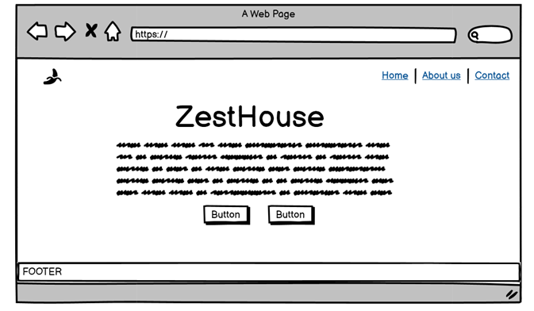
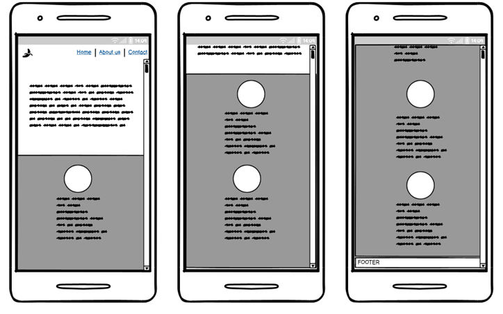
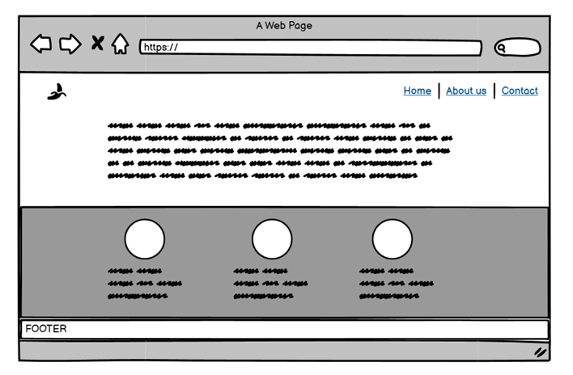
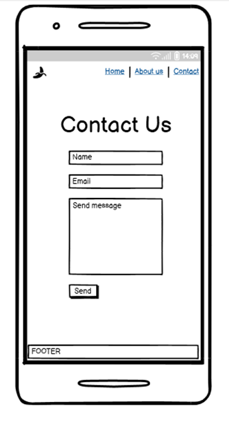
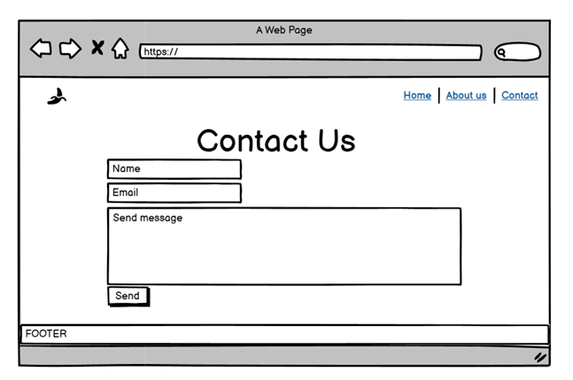

# PROJECT NAME TO GO HERE

👩🏻‍💻 View an example of this section [here](https://github.com/kera-cudmore/Bully-Book-Club#bully-book-club-website)

Add a Blurb about the site here, what does it do, why did you build it?

Add an image of the finished site here. I like to use [amiresponsive](https://ui.dev/amiresponsive) to get an image of my site on all device sizes, and amiresponsive allows you to click links on the page and scroll, so each device can show a different element of your site.

Add a link to the live site here, for Milestone 1 this will be the GitHub Pages Link from when you deployed the site.

If you want to add optional [shields.io](https://shields.io) badges to your README, I like to add them to this section.

---

## CONTENTS

* [User Experience](#user-experience-ux)
  * [User Stories](#user-stories)

* [Design](#design)
  * [Colour Scheme](#colour-scheme)
  * [Typography](#typography)
  * [Imagery](#imagery)
  * [Wireframes](#wireframes)

* [Features](#features)
  * [General Features on Each Page](#general-features-on-each-page)
  * [Future Implementations](#future-implementations)
  * [Accessibility](#accessibility)

* [Technologies Used](#technologies-used)
  * [Languages Used](#languages-used)
  * [Frameworks, Libraries & Programs Used](#frameworks-libraries--programs-used)

* [Deployment & Local Development](#deployment--local-development)
  * [Deployment](#deployment)
  * [Local Development](#local-development)
    * [How to Fork](#how-to-fork)
    * [How to Clone](#how-to-clone)

* [Testing](#testing)

* [Credits](#credits)
  * [Code Used](#code-used)
  * [Content](#content)
  * [Media](#media)
  * [Acknowledgments](#acknowledgments)

---

## User Experience (UX)

### User Stories

**First Time Visitor Goals**

* I want to find out what ZestHouse is and what facilities are avaliable
* I want to find out where ZestHouse is
* I want to be able to navigate the website with ease

**Returning Visitor Goals**

* I want to be able to contact ZestHouse easily with any questions or feedback i might have
* I want to easly connect with their social media

## Design

### Colour Scheme

Two of the colours (#c92324 and #ea861a) used were chosen using a color picker from the background image(see the Imagery section below). Then a [colour palette generator](http://colormind.io/bootstrap/) was used to choose complimentary colours (#084208 and #f4f7f9). [The contrast checker](https://webaim.org/resources/contrastchecker/) showed that the contrast between the navbar background and text is good (ratio 10.88:1). However, the contrast ratio was too low for the colors used for the main paragraphs (#ea861a for the background and #084208 for the text). Thus, to improve accessibility, a lighter color (#f2d363) was choosen for the background, bringing the contrast ratio score to 7.96:1.

### Typography

The fonts used for the website are imported from [Google Fonts](https://fonts.google.com/).
The font chosen for the logo as well as all the headings is Viga. It is described as having a good performance on the screen as well as a great personality.

A [font pairing website](http://www.ourownthing.co.uk/fontpairing/) was then used to pick Anek Bangla, the font used for all the other text, such as paragraphs and buttons.

### Imagery

The main image, used for the background, is from [unsplash.com](https://unsplash.com/photos/drzu0uPgmoU). It is a royalty free image, and is credited to an user Engin Akyurt.

The image was chosen due to its vibrant colours and the fruit looking like its bursting with flavour and vitamins. It is supposed to be associated with concepts such as freshness, nutrition, health and wellness. 

Images used for the facilities section in the About Us Page:

[Photo by Alexas Fotos from Pexels](https://www.pexels.com/photo/close-up-photo-of-stacked-tissue-rolls-10760874/)

[Photo by OVAN from Pexels](https://www.pexels.com/photo/person-sitting-facing-laptop-computer-with-sketch-pad-57690/)

[Photo by Ivan Samkov from Pexels](https://www.pexels.com/photo/people-celebrating-a-little-girl-s-birthday-7922014/)

### Wireframes

Wireframes were created for mobile and desktop using Balsamiq software.

#### Index Page

#### About Us Page

#### Contact Us Page

## Features

👩🏻‍💻 View an example of a completed user experience section [here](https://github.com/kera-cudmore/TheQuizArms#Features)

This section can be used to explain what pages your site is made up of.

### General features on each page

NAVBAR FROM https://getbootstrap.com/docs/5.3/components/dropdowns/

If there is a feature that appears on all pages of your site, include it here. Examples of what to include would the the navigation, a footer and a favicon.

I then like to add a screenshot of each page of the site here, i use [amiresponsive](https://ui.dev/amiresponsive) which allows me to grab an image of the site as it would be displayed on mobile, tablet and desktop, this helps to show the responsiveness of the site.

### Future Implementations

What features would you like to implement in the future on your site? Would you like to add more pages, or create login functionality? Add these plans here.

### Accessibility

Be an amazing developer and get used to thinking about accessibility in all of your projects!

This is the place to make a note of anything you have done with accessibility in mind. Some examples include:

Have you used icons and added aria-labels to enable screen readers to understand these?
Have you ensured your site meets the minimum contrast requirements?
Have you chosen fonts that are dyslexia/accessible friendly?

Code Institute have an amazing channel for all things accessibility (a11y-accessibility) I would highly recommend joining this channel as it contains a wealth of information about accessibility and what we can do as developers to be more inclusive.

## Technologies Used

👩🏻‍💻 View an example of a completed Technologies Used section [here](https://github.com/kera-cudmore/Bully-Book-Club#Technologies-Used)

### Languages Used

Make a note here of all the languages used in creating your project. For the first project this will most likely just be HTML & CSS.

### Frameworks, Libraries & Programs Used

* Bootstrap
* Balsamiq
* Google Fonts
* Colormind.io
* Webaim.org Contrast Checker
* Hover.css by Ian Lunn
* FontAwesome

## Deployment & Local Development

👩🏻‍💻 View an example of a completed Deployment & Local Development section [here](https://github.com/kera-cudmore/TheQuizArms#Deployment)

### Deployment

Include instructions here on how to deploy your project. For your first project you will most likely be using GitHub Pages.

### Local Development

The local development section gives instructions on how someone else could make a copy of your project to play with on their local machine. This section will get more complex in the later projects, and can be a great reference to yourself if you forget how to do this.

#### How to Fork

Place instructions on how to fork your project here.

#### How to Clone

Place instructions on how to clone your project here.

## Testing

Start as you mean to go on - and get used to writing a TESTING.md file from the very first project!

Testing requirements aren't massive for your first project, however if you start using a TESTING.md file from your first project you will thank yourself later when completing your later projects, which will contain much more information.
  
Use this part of the README to link to your TESTING.md file - you can view the example TESTING.md file [here](milestone1-testing.md)

## Credits

👩🏻‍💻 View an example of a completed Credits section [here](https://github.com/kera-cudmore/BookWorm#Credits)

The Credits section is where you can credit all the people and sources you used throughout your project.

### Code Used

If you have used some code in your project that you didn't write, this is the place to make note of it. Credit the author of the code and if possible a link to where you found the code. You could also add in a brief description of what the code does, or what you are using it for here.

### Content

Who wrote the content for the website? Was it yourself - or have you made the site for someone and they specified what the site was to say? This is the best place to put this information.

###  Media

If you have used any media on your site (images, audio, video etc) you can credit them here. I like to link back to the source where I found the media, and include where on the site the image is used.
  
###  Acknowledgments

If someone helped you out during your project, you can acknowledge them here! For example someone may have taken the time to help you on slack with a problem. Pop a little thank you here with a note of what they helped you with (I like to try and link back to their GitHub or Linked In account too). This is also a great place to thank your mentor and tutor support if you used them.